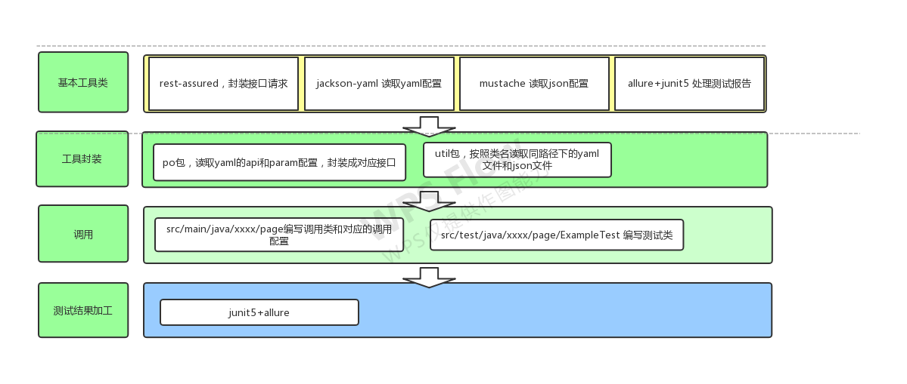

### 项目实现
- 构建工具： maven
- 接口调用： rest-assured
- 测试框架： junit5
- 测试用例加工： jacksonYaml,mustache
- 测试报告优化： allure
### 项目结构 



### 用例编写方式
- src/main/java/com.example.page/xxx 定义业务调用 Example.java，编写对应的调用yaml,json文件。
- 示例：
   yaml中需要传入测试参数时，业务调用代码.java：
``` java 
    public static Response login(HashMap<String, String> map)   {
            return PageObjectModel.parseAPI(当前类类名.class,map);
    }
```
- src/main/java/com.example.page/xxx 定义配置 example.yaml
``` yaml
apilist:
  login:
    api:
      get: /caizhi_miniapi/index/auth.do
      params: userId,corpId
paramlist:
  testLoginSuccess:
    param:
      userId: YinZhenZhi
      corpId: ww8c83d949a80b562d
```
- src/test/java/com.example.page/xxx 定义测试调用 ExampleTest.java。
``` java
    @Test
    public void testLoginSuccess()   {
        HashMap map = PageObjectModel.parseParam(BaseAPI.class);
        api.login(map)
                .then()
                .body("ret", equalTo(0));
    }
```
### yaml配置编写规范
- yaml文件必须和对应的业务调用.java文件在同一地址
- yaml文件名称必须和对应的业务调用.java文件的小写同名
- yaml中的apilist的命名与对应业务调用.java文件中的调用方法名一致
- yaml中的paramlist的命名与对应的业务测试.java文件中的调用方法名一致
- yaml中的param中的参数与api中调用的需一致
### 执行
``` shell
mvn clean test
allure serve target/allure-results
allure report
```
report地址： target/site/allure-maven-plugin/index.html
### 待完善
- 报告自带restAssured日志
- 报告发送邮件
- jenkins集成
- 断言结合mybatis
- 代码优化：yaml传参枚举，异常加工，配置文件路径硬编码，json文件路径配置
